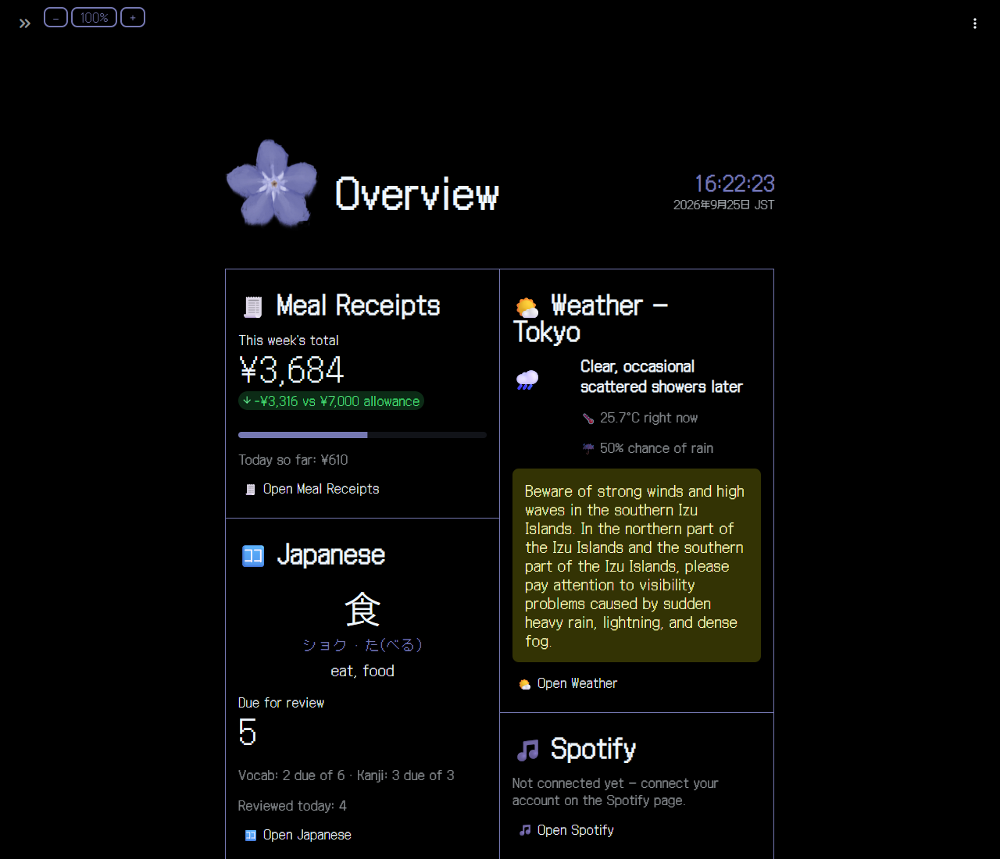
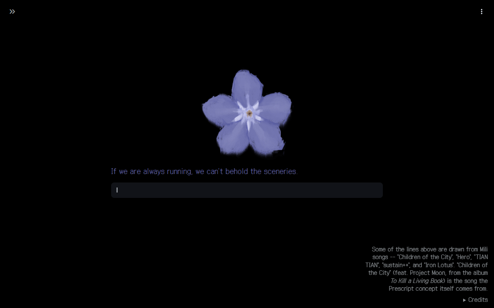
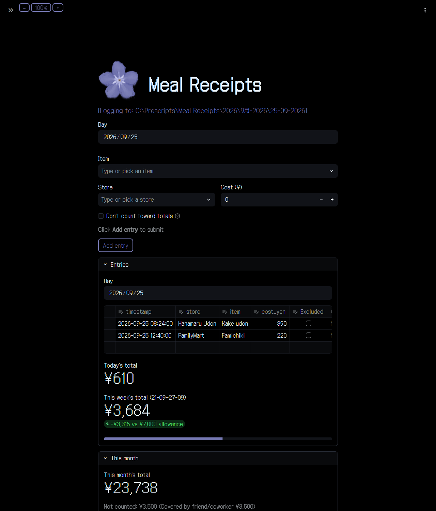
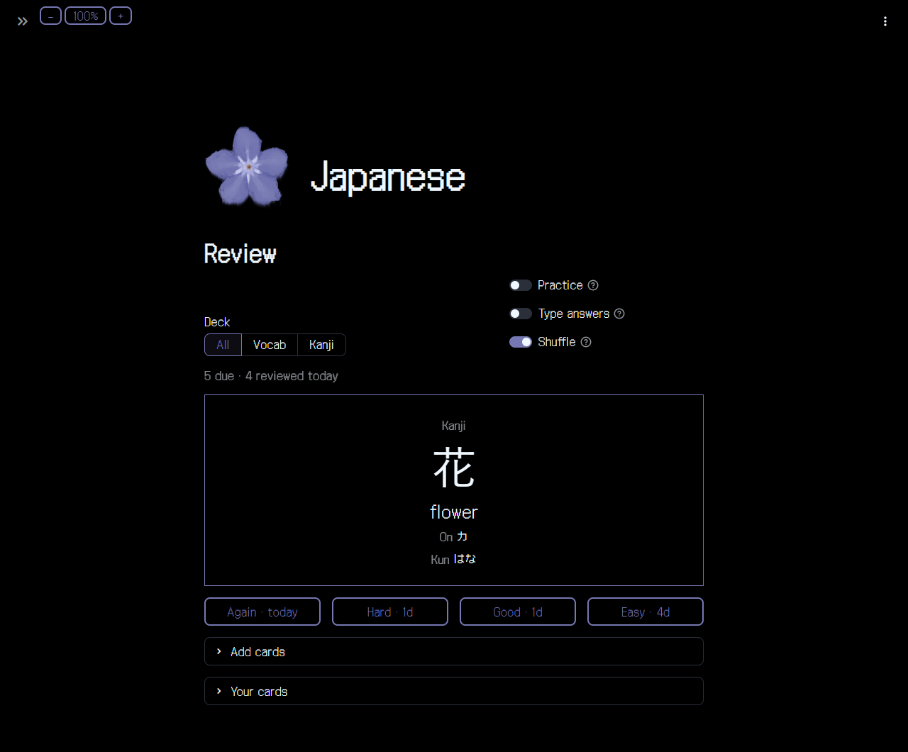
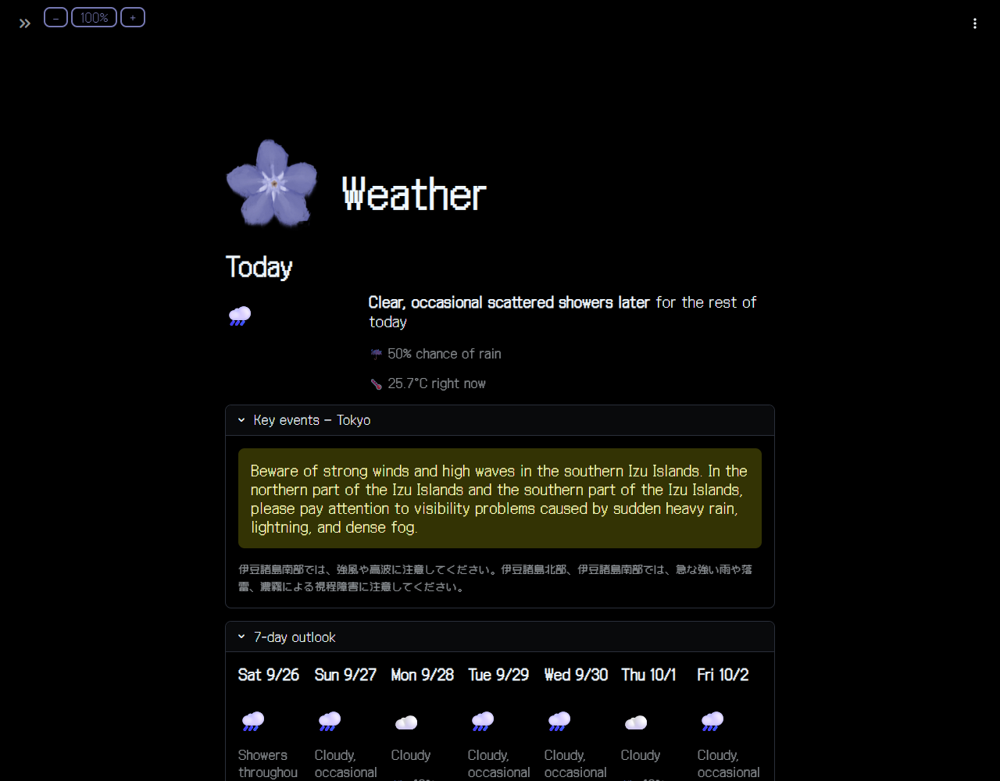

# The Prescripts

A personal dashboard app for everyday life in Japan, themed on the Prescripts of [The Index](https://library-of-ruina.fandom.com/wiki/The_Index), from Project Moon's games. It runs on your own computer in its own window and keeps all its data in plain files next to the code.

| Page | What it does |
|---|---|
| **Overview** | A summary tile from each of the other pages, all on one screen |
| **Meal Receipts** | Log meals and spending against a daily or weekly budget |
| **Weather** | Forecasts, warnings and live readings from the Japan Meteorological Agency |
| **Spotify** | See and control what's playing, with lyrics (needs a one-off setup, below) |
| **Japanese** | Vocabulary and kanji flashcards with spaced-repetition reviews |



<details>
<summary><b>More screenshots</b></summary>

**Home**: Initial page. Type what you're after or pick a page from the » menu.


**Meal Receipts**: log a meal, see the day's entries, and track the week against a budget.


**Japanese**: flashcard reviews, graded Again / Hard / Good / Easy.


**Weather**: today, warnings, and a 7-day outlook from the Japan Meteorological Agency.


</details>

*Screenshots show made-up sample data.*

Personal portfolio project developed with the help of PeaceWorks K.K. and ORBWEVA.

---

## What you need

- **Windows 10 or 11.** This is the tested setup. (Mac/Linux: see [Not on Windows?](#not-on-windows))
- **Python 3.12** from [python.org/downloads](https://www.python.org/downloads/). The installer's defaults are fine.
- **Git**, from [git-scm.com](https://git-scm.com/downloads). Optional: you can download a ZIP instead (step 2).
- **An internet connection.** Weather, lyrics and Japanese word lookups fetch live data. Nothing needs an account or API key except Spotify.

To check Python is installed, open **PowerShell** (Start menu → type "PowerShell") and run:

```powershell
py -3.12 --version
```

It should print `Python 3.12.x`. If it says the command isn't found, install Python first, then close and reopen PowerShell.

## Install

All commands below are typed into PowerShell.

**1. Make a folder for the app.** The app saves your data (meals, flashcards, settings) in folders *next to* the code, so give it a folder of its own. Keep the path short: some of the installed files are deeply nested, and Windows rejects very long paths.

```powershell
mkdir $HOME\Prescripts
cd $HOME\Prescripts
```

**2. Get the code.**

```powershell
git clone https://github.com/tiexuelianhua/prescripts-project.git
cd prescripts-project
```

No Git? On the [GitHub page](https://github.com/tiexuelianhua/prescripts-project), click **Code → Download ZIP**, extract it into `$HOME\Prescripts`, and `cd` into the extracted folder instead.

**3. Create a virtual environment.** This is a private copy of Python just for this app, so nothing it installs affects the rest of your computer.

```powershell
py -3.12 -m venv .venv
```

**4. Install the app's packages.** This takes a minute or two.

```powershell
.venv\Scripts\python -m pip install -r requirements.txt
```

That's the whole install.

## Run

From the `prescripts-project` folder:

```powershell
.venv\Scripts\python desktop_app.py
```

After a few seconds, a window titled **The Prescripts** opens on the Home page. Pick a page from the arrow (**»**) in the top-left corner, or type what you're after into the box.

**To quit:** close the window, or press **Ctrl+Q**. Closing it stops the app completely, so the next launch starts fresh.

**Prefer your web browser?** Run this instead, and it opens in a browser tab at <http://127.0.0.1:8501>:

```powershell
.venv\Scripts\python -m streamlit run app.py
```

Press **Ctrl+C** in PowerShell to stop it.

### Optional: a desktop shortcut

So you can start the app by double-clicking, run this once from the `prescripts-project` folder:

```powershell
$shortcut = (New-Object -ComObject WScript.Shell).CreateShortcut("$([Environment]::GetFolderPath('Desktop'))\The Prescripts.lnk")
$shortcut.TargetPath = "$PWD\.venv\Scripts\pythonw.exe"
$shortcut.Arguments = "desktop_app.py"
$shortcut.WorkingDirectory = "$PWD"
$shortcut.Save()
```

A **The Prescripts** icon appears on your desktop. To pin it to the taskbar, right-click it → **Show more options** → **Pin to taskbar**. If that option is missing, drag the icon onto the taskbar instead.

Want it open (minimised) whenever you sign in? Press **Win+R**, type `shell:startup`, press Enter, and copy the shortcut into that folder. Then right-click the copy → **Properties** and change **Target** so it ends in `desktop_app.py --minimized`.

> You'll also see `ThePrescriptsLauncher.exe` / `LauncherSrc` mentioned in the code. That's a small launcher the original author compiles for themselves. It isn't included in the repo, and the shortcut above does the same job.

## Optional: connect Spotify

Every page except Spotify works straight away. The Spotify page needs your own (free) Spotify developer app, because Spotify doesn't let apps like this share one. Until you set it up, the page just says no credentials were found.

1. Go to the [Spotify Developer Dashboard](https://developer.spotify.com/dashboard), sign in with your Spotify account, and click **Create app**.
2. Give it any name and description. Under **Redirect URIs**, add exactly:
   ```
   http://127.0.0.1:8501/spotify_page
   ```
   Tick **Web API**, agree to the terms, and save.
3. Open the app's **Settings** and copy its **Client ID** and **Client secret** (click "View client secret").
4. In your `Prescripts` folder (next to `prescripts-project`, not inside it), create a folder called `Spotify`. In it, create a file called `settings.json` with this in it, using your two values:
   ```json
   {
     "client_id": "paste your Client ID here",
     "client_secret": "paste your Client secret here"
   }
   ```
5. Restart the app, open the Spotify page, and click **Connect to Spotify**.

Playback controls act on whichever device you're already playing Spotify on (phone, desktop app, …). Spotify only allows remote control with a **Premium** account.

## Where your data lives

Everything is saved as ordinary files in folders beside the code, never inside it. You can update the code, or delete and re-clone it, without losing anything:

```
Prescripts\
├── prescripts-project\   ← the code (this repository)
├── Meal Receipts\        ← created when you first log a meal
├── Japanese\             ← your flashcards
├── Weather\              ← your chosen forecast area (default: Tokyo)
├── Spotify\              ← your Spotify keys + connection
└── app_settings.json     ← app-wide preferences, e.g. zoom level
```

Back up the `Prescripts` folder to back up everything.

## Handy to know

- **F11** toggles full screen in the app window.
- The **🏠** button at the top of every page except Home, or **Ctrl+Shift+H**, goes back to Home.
- The **− 100% +** buttons at the top of every page except Home zoom the page. The zoom level is remembered.
- Times and dates are in **Japan time (JST)** whatever your computer's clock says, and the Weather page covers Japan only.
- To update to the newest version: `git pull` in the `prescripts-project` folder, then run step 4 again.

## Checking it works

The project has automated tests. They load every page and check the rules underneath, like flashcard scheduling, typed answers and what counts toward a budget. They use a throwaway copy of the app in a temporary folder, so your own data is never touched. From the `prescripts-project` folder:

```powershell
.venv\Scripts\python -m pip install -r requirements-dev.txt
.venv\Scripts\python -m pytest
```

It takes about a minute and should finish with `19 passed`. Close the app first if it's running: installing packages while it's open can fail, because Windows locks files the app is using.

### Updating the screenshots

The screenshots above can be retaken with one command. It needs Chrome or Edge installed:

```powershell
.venv\Scripts\python tools\take_screenshots.py
```

It runs a throwaway copy of the app in `C:\Prescripts`, filled with made-up sample data, screenshots each page into `docs/screenshots/`, and deletes `C:\Prescripts` again. Your own data is never used. Look at each image before committing: the Home prompt is picked at random, and Weather shows that day's real forecast.

## Troubleshooting

**`py` is not recognised.** Python isn't installed, or PowerShell was opened before it was. Install Python 3.12 from python.org, then open a new PowerShell window.

**Install fails with `The filename or extension is too long`.** The folder path is too long for Windows. Move the project somewhere shorter (like `$HOME\Prescripts`), delete the `.venv` folder, and redo steps 3–4.

**The window doesn't open at all.** The desktop window uses Microsoft Edge WebView2, which is built into Windows 11 and most up-to-date Windows 10 PCs. If it's missing, install the "Evergreen Bootstrapper" from [Microsoft's WebView2 page](https://developer.microsoft.com/microsoft-edge/webview2/), or use the browser option under [Run](#run).

**Spotify says the redirect URI is invalid.** The Redirect URI in your Spotify app's settings must match `http://127.0.0.1:8501/spotify_page` exactly: `127.0.0.1`, not `localhost`, and no trailing slash.

## Not on Windows?

This hasn't been tested on Mac or Linux. The browser version should work there. Use `python3` in place of `py -3.12`, and `.venv/bin/python` in place of `.venv\Scripts\python`:

```bash
python3 -m venv .venv
.venv/bin/python -m pip install -r requirements.txt
.venv/bin/python -m streamlit run app.py
```

The app window (`desktop_app.py`) and the desktop shortcut are Windows-only.

## Credits

- The Prescripts come from The Index, a faction in Project Moon's games: see The Index on the [Library of Ruina wiki](https://library-of-ruina.fandom.com/wiki/The_Index) and the [Limbus Company wiki](https://limbuscompany.wiki.gg/wiki/The_Index).
- Forget-me-not logo drawn by a friend of the author.
- The glitch when you arrive on Home was inspired by Limbus Company's [000] trailer ([YouTube](https://youtu.be/Y2-VkdfA2os)), without copying its style.
- Colours, font choice and button style are taken from the fan site [prescript.neocities.org](https://prescript.neocities.org/).
- Pixel font: [Galmuri](https://github.com/quiple/galmuri) by quiple, under the SIL Open Font License (`static/Galmuri-OFL.txt`).
- Weather: [Japan Meteorological Agency](https://www.jma.go.jp/bosai/). Lyrics: [LRCLIB](https://lrclib.net). Word lookups: [Jisho](https://jisho.org) and [kanjiapi.dev](https://kanjiapi.dev).
