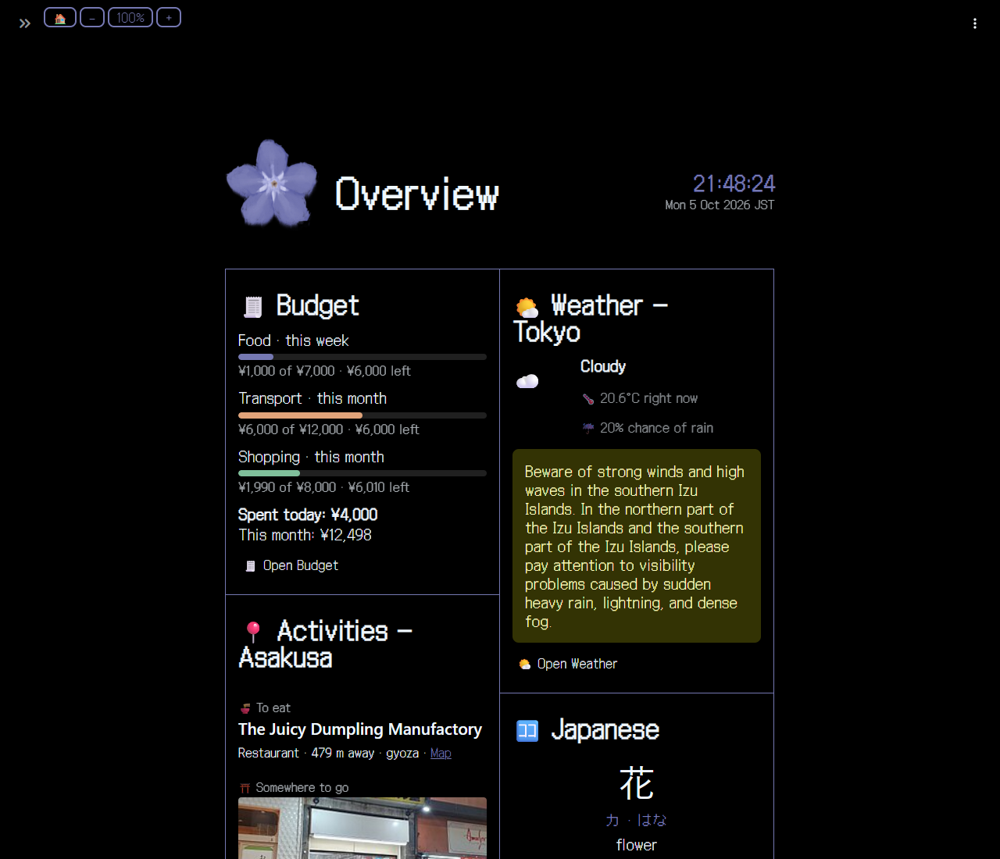
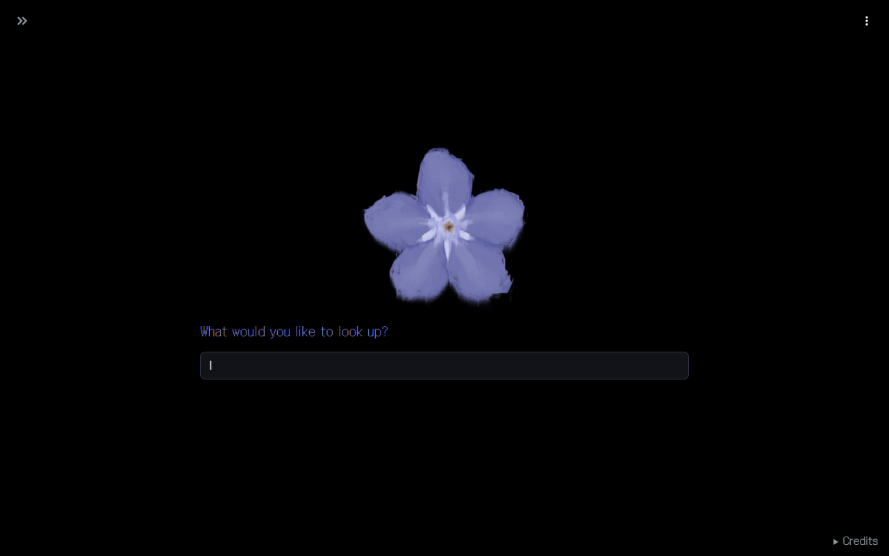
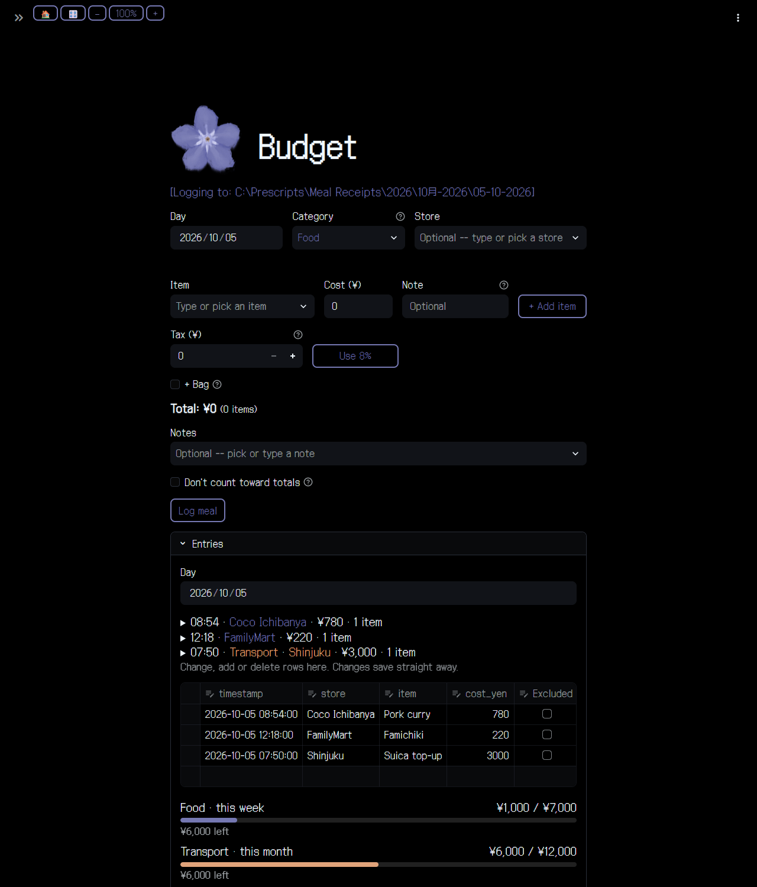
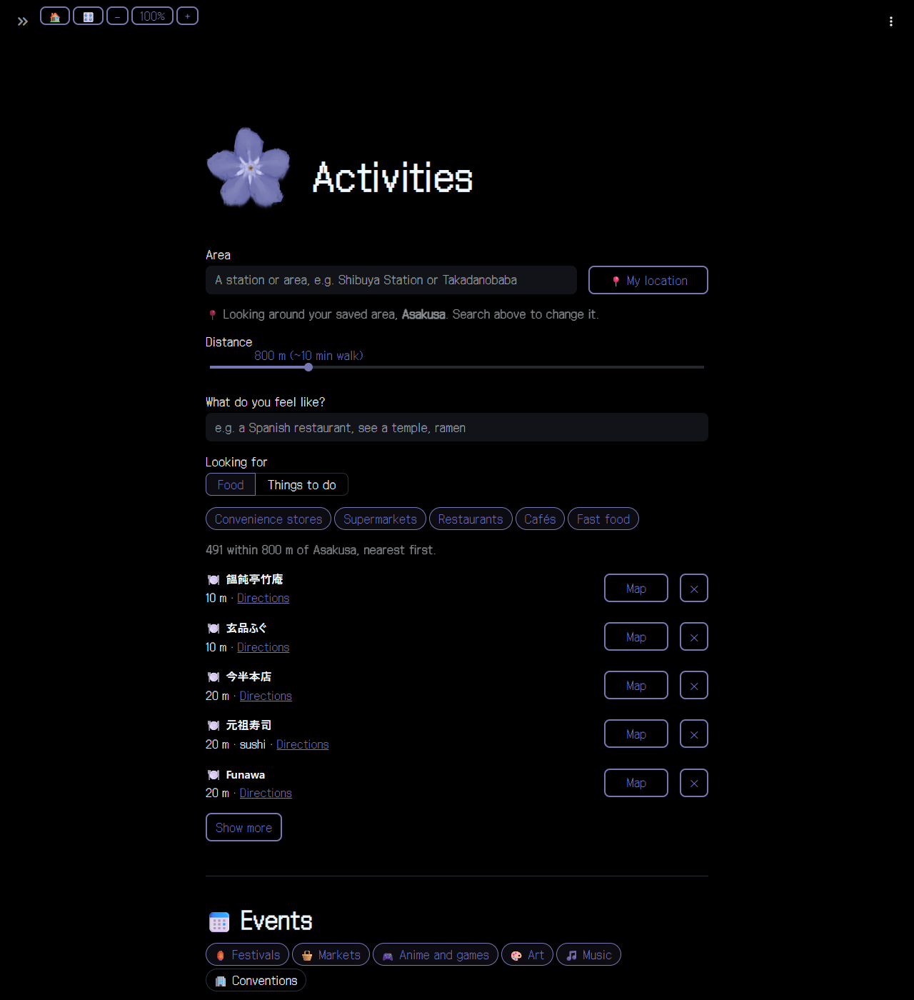
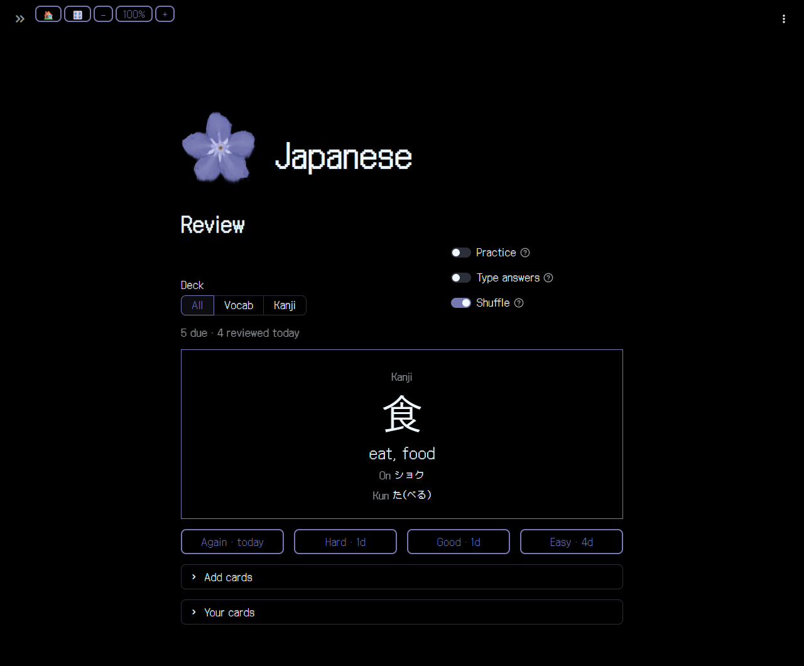
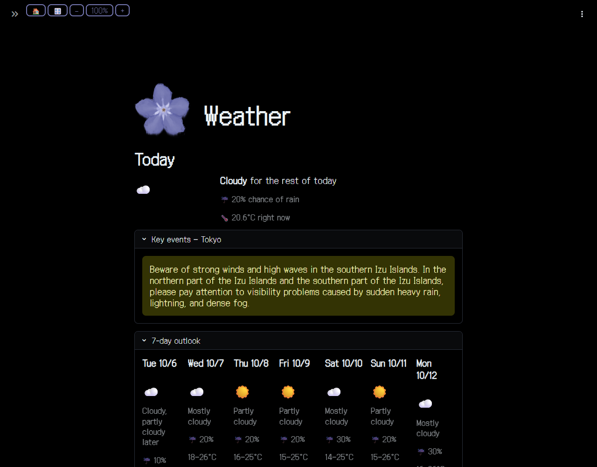

# The Prescripts

[](https://github.com/tiexuelianhua/prescripts-project/actions/workflows/tests.yml)

A personal dashboard app for everyday life in Japan, themed on the Prescripts of [The Index](https://library-of-ruina.fandom.com/wiki/The_Index), from Project Moon's games. It runs on your own computer in its own window and keeps all its data in plain files next to the code.

| Page | What it does |
|---|---|
| **Overview** | A summary tile from each of the other pages, all on one screen |
| **Budget** | Log meals, train top-ups, shopping and other spending by category, each with its own daily, weekly or monthly budget |
| **Weather** | Forecasts, warnings and live readings from the Japan Meteorological Agency |
| **Activities** | Food and things to do within walking distance of a station, an area, or where you are, plus festivals, markets and other events coming up around Tokyo |
| **Spotify** | See and control what's playing, with lyrics (needs a one-off setup, below) |
| **Japanese** | Vocabulary and kanji flashcards with spaced-repetition reviews |
| **Settings** | English only, switching pages and Overview tiles on or off (Spotify starts off), and updates |



<details>
<summary><b>More screenshots</b></summary>

**Home**: Initial page. Type what you're after or pick a page from the » menu.


**Budget** (called Meal Receipts until October 2026): log a receipt item by item with a running total, and see the day's spending. Each receipt has a category (Food, Transport, Shopping, Other, or one you add), and each category can have its own budget, shown as a coloured bar. Transport receipts take From/To stations instead of a store, with a button to swap them for the trip back. One go can mix categories, so a whole day can be logged at once. Month by month shows the last six months, either all spending side by side or one category against its budget. Typing a category on Home, like "shopping budget", opens the page on it.


**Activities**: places to eat and things to do around a saved area, nearest first, then events coming up. Places come from OpenStreetMap, so many only have a Japanese name.


**Japanese**: flashcard reviews, graded Again / Hard / Good / Easy. New cards can be filled in from Jisho, and vocab cards show their part of speech (noun, godan verb and so on). Practice can go round every card, ones you've picked (like kanji you've just added), or just verbs, adjectives or nouns. Cards that are new to you start in Learn, to study at your own pace with your own notes, or a mnemonic drawn over the card with a mouse, pen or finger, before they're reviewed. A kanji there shows the words in your deck that use it, and whether each one uses its on'yomi or kun'yomi.


**Weather**: today, warnings, and a 7-day outlook from the Japan Meteorological Agency.


</details>

*Screenshots show made-up sample data.*

Personal portfolio project developed with the help of PeaceWorks K.K. and ORBWEVA.

The author directed the project and how it was implemented. The code itself was written by [Claude Code](https://claude.com/claude-code), Anthropic's AI coding assistant.

It started as one hand-written PowerShell script that makes a folder for each day's meal receipts. That script, the original project idea, and a comparison of it with the AI-assisted version (`addDay_cV.ps1`) are kept in [`docs/origins`](docs/origins). They aren't used by the app.

---

## What you need

- **Windows 10 or 11.** This is the tested setup. On a Mac or Linux, skip to [Not on Windows?](#not-on-windows).
- **Python 3.12** (not a newer version). Download the [Python 3.12.10 Windows installer](https://www.python.org/ftp/python/3.12.10/python-3.12.10-amd64.exe) and run it. The installer's defaults are fine. The python.org download page now leads with Python 3.14 and the "Python install manager". If you already have the install manager, run `py install 3.12` in PowerShell instead.
- **Git**, from [git-scm.com](https://git-scm.com/downloads). Optional: you can download a ZIP instead (step 2).
- **An internet connection.** Weather, Activities, lyrics, and Japanese word lookups fetch live data. Nothing needs an account or API key except Spotify.

To check Python is installed, open **PowerShell** (Start menu → type "PowerShell") and run:

```powershell
py -3.12 --version
```

It should print `Python 3.12.x`. If it says the command isn't found, install Python first, then close and reopen PowerShell.

## Install

All commands below are typed into PowerShell.

**1. Make a folder for the app.** The app saves your data (meals, flashcards, settings) in folders *next to* the code, so give it a folder of its own. Keep the path short: some of the installed files are deeply nested, and Windows rejects very long paths.

```powershell
mkdir $HOME\Prescripts
cd $HOME\Prescripts
```

**2. Get the code.**

```powershell
git clone https://github.com/tiexuelianhua/prescripts-project.git
cd prescripts-project
```

No Git? On the [GitHub page](https://github.com/tiexuelianhua/prescripts-project), click **Code → Download ZIP** and extract it into `$HOME\Prescripts`. The extracted folder is called `prescripts-project-main`: rename it to `prescripts-project` (the rest of this README uses that name), make sure it isn't nested inside another folder of the same name, and `cd prescripts-project`.

**3. Create a virtual environment.** This is a private copy of Python just for this app, so nothing it installs affects the rest of your computer.

```powershell
py -3.12 -m venv .venv
```

**4. Install the app's packages.** This takes a minute or two.

```powershell
.venv\Scripts\python -m pip install -r requirements.txt
```

That's the whole install.

## Run

From the `prescripts-project` folder:

```powershell
.venv\Scripts\python desktop_app.py
```

After a few seconds, a window titled **The Prescripts** opens on the Home page. Pick a page from the arrow (**»**) in the top-left corner, or type what you're after into the box.

**To quit:** close the window, or press **Ctrl+Q**. Closing it stops the app completely, so the next launch starts fresh.

**Prefer your web browser?** Run this instead, and it opens in a browser tab at <http://127.0.0.1:8501>:

```powershell
.venv\Scripts\python -m streamlit run app.py
```

The first time you do this, Streamlit asks for an email address in PowerShell. It's optional: press **Enter** to skip it, and the browser tab opens. Press **Ctrl+C** in PowerShell to stop it.

### Optional: a desktop shortcut

So you can start the app by double-clicking, run this once from the `prescripts-project` folder:

```powershell
$shortcut = (New-Object -ComObject WScript.Shell).CreateShortcut("$([Environment]::GetFolderPath('Desktop'))\The Prescripts.lnk")
$shortcut.TargetPath = "$PWD\.venv\Scripts\pythonw.exe"
$shortcut.Arguments = "desktop_app.py"
$shortcut.WorkingDirectory = "$PWD"
$shortcut.Save()
```

A **The Prescripts** icon appears on your desktop. To pin it to the taskbar, right-click it → **Show more options** → **Pin to taskbar**. If that option is missing, drag the icon onto the taskbar instead.

Want it open (minimised) whenever you sign in? Press **Win+R**, type `shell:startup`, press Enter, and copy the shortcut into that folder. Then right-click the copy → **Properties** and change **Target** so it ends in `desktop_app.py --minimized`.

> You'll also see `ThePrescriptsLauncher.exe` / `LauncherSrc` mentioned in the code. That's a small launcher the original author compiles for themselves. It isn't included in the repo, and the shortcut above does the same job.

The app starts in English only, with the Japanese page switched off. Both can be changed on the **Settings** page. Things that only come in Japanese, like some event names, are marked (in Japanese).

## Optional: connect Spotify

Every page except Spotify works straight away. Spotify needs your own (free) Spotify developer app, because Spotify doesn't let apps like this share one.

1. In the app, open **Settings** and switch the **Spotify** page on. It starts off, so until you do this it won't show up in the page list.
2. Go to the [Spotify Developer Dashboard](https://developer.spotify.com/dashboard), sign in with your Spotify account, and click **Create app**.
3. Give it any name and description. Under **Redirect URIs**, add exactly:
   ```
   http://127.0.0.1:8501/spotify_page
   ```
   Tick **Web API**, agree to the terms, and save.
4. Open your Spotify app's settings on the dashboard and copy its **Client ID** and **Client secret** (click "View client secret").
5. In The Prescripts, open the **Spotify** page, paste the two keys in, and click **Save keys**. The page checks them with Spotify first, so a mistyped key shows up straight away.
6. Click **Connect to Spotify**. Spotify opens in your web browser: approve it there, and the app window connects by itself a moment later. You can close the browser tab.

The keys are saved in `Spotify\settings.json` in your `Prescripts` folder. To use a different Spotify app later, open **Use different keys** under the Connect button.

Playback controls act on whichever device you're already playing Spotify on (phone, desktop app, …). Spotify only allows remote control with a **Premium** account.

## Where your data lives

Everything is saved as ordinary files in folders beside the code, never inside it. You can update the code, or delete and re-clone it, without losing anything.

Each folder or file appears the first time you save something on that page or change a setting, so a fresh install has only `prescripts-project`. Once you've used everything, it looks like this:

```
Prescripts\
├── prescripts-project\   ← the code (this repository)
├── Meal Receipts\        ← the Budget page's receipts
├── Japanese\             ← your flashcards
├── Weather\              ← your chosen forecast area (default: Tokyo)
├── Activities\           ← your saved area and walking distance, events you've added, plus recent searches
├── Spotify\              ← your Spotify keys + connection
├── quotes.json           ← quotes you add on Home
└── app_settings.json     ← app-wide preferences: zoom level, English only, which pages and tiles are on
```

Back up the `Prescripts` folder to back up everything.

## Handy to know

- **F11** toggles full screen in the app window.
- The **🏠** button at the top of every page except Home, or **Ctrl+Shift+H**, goes back to Home.
- The **🎛️** button next to it, or **Ctrl+Shift+O** from any page, goes to Overview.
- The **− 100% +** buttons at the top of every page except Home zoom the page. The zoom level is remembered.
- Times and dates are in **Japan time (JST)** whatever your computer's clock says, and the Weather page covers Japan only.
- **Updates:** the **Settings** page shows when there's a new version and what's changed. Click **Update and restart**, and the app updates and opens again by itself. It only offers versions that passed the automated tests, and never updates without the click. This works if you installed with `git clone`. Installed from the ZIP? Download it again and copy what's inside `prescripts-project-main` over your `prescripts-project` folder, replacing the files, then run step 4. Your data isn't in that folder, so nothing is lost either way.
- To update by hand instead (or when running in the browser): close the app, run `git pull` in the `prescripts-project` folder, then run step 4 again.

## Checking it works

The project has automated tests. They load every page and check the rules underneath, like flashcard scheduling, typed answers and what counts toward a budget. They use a throwaway copy of the app in a temporary folder, so your own data is never touched. From the `prescripts-project` folder:

```powershell
.venv\Scripts\python -m pip install -r requirements-dev.txt
.venv\Scripts\python -m pytest
```

It takes about four minutes and should finish with `67 passed`. Close the app first if it's running: installing packages while it's open can fail, because Windows locks files the app is using.

To check the code for mistakes like unused or undefined names, and for import order, run `.venv\Scripts\ruff check .` (add `--fix` to sort the imports for you). The settings are in `pyproject.toml`.

The tests also run on GitHub on Windows, Mac, and Linux after every push, along with the ruff check. The badge at the top of this page shows the latest result.

### Updating the screenshots

The screenshots above can be retaken with one command. It needs Chrome or Edge installed:

```powershell
.venv\Scripts\python tools\take_screenshots.py
```

It runs a throwaway copy of the app in `C:\Prescripts`, filled with made-up sample data, screenshots each page into `docs/screenshots/`, and deletes `C:\Prescripts` again. Your own data is never used. Look at each image before committing: the Home prompt is picked at random, and Weather shows that day's real forecast.

## Troubleshooting

**`py` is not recognised.** Python isn't installed, or PowerShell was opened before it was. Install Python 3.12 from python.org, then open a new PowerShell window.

**Install fails with `The filename or extension is too long`.** The folder path is too long for Windows. Move the project somewhere shorter (like `$HOME\Prescripts`), delete the `.venv` folder, and redo steps 3–4.

**The window doesn't open at all.** The desktop window uses Microsoft Edge WebView2, which is built into Windows 11 and most up-to-date Windows 10 PCs. If it's missing, install the "Evergreen Bootstrapper" from [Microsoft's WebView2 page](https://developer.microsoft.com/microsoft-edge/webview2/), or use the browser option under [Run](#run).

**Spotify says the redirect URI is invalid.** The Redirect URI in your Spotify app's settings must match `http://127.0.0.1:8501/spotify_page` exactly: `127.0.0.1`, not `localhost`, and no trailing slash.

## Not on Windows?

On Mac and Linux, the app runs in your web browser. The app window (`desktop_app.py`) and the desktop shortcut are Windows-only. This setup is covered by an automated test on Windows but hasn't been tried on a real Mac or Linux machine yet.

1. **Install Python 3.12.** Mac: the [Python 3.12.10 macOS installer](https://www.python.org/ftp/python/3.12.10/python-3.12.10-macos11.pkg). Linux: `python3.12` from your package manager. Check it with `python3.12 --version`.
2. **Get the code**, the same as on Windows ([step 2](#install)). On a Mac, the first `git` command may offer to install Apple's developer tools; accept, or use the ZIP instead.
3. **Install and run**, in Terminal from the `prescripts-project` folder:

   ```bash
   python3.12 -m venv .venv
   .venv/bin/python -m pip install -r requirements.txt
   .venv/bin/python -m streamlit run app.py
   ```

   As on Windows, press **Enter** if Streamlit asks for an email, and **Ctrl+C** to stop it.

Everywhere else in this README, use `.venv/bin/python` in place of `.venv\Scripts\python`. The tests usually finish with `63 passed, 4 skipped`: three of the skipped tests check PowerShell scripts, and only run if PowerShell is installed, and one checks the Windows-only app window.

## How it's built

The app is written in Python with [Streamlit](https://streamlit.io), which turns Python scripts into web pages, so there's no separate front end to build. Each page is split in two: a file in `prescripts/pages` that lays out what you see, and a file with the same name in `prescripts/data` that does the work (reading and saving files, calling web services, and the rules like flashcard scheduling or budgets).

```
desktop_app.py               starts the Streamlit server and shows it in its own window (pywebview)
app.py                       shared look, top bar, and navigation between pages
prescripts/
├── common.py                what every page shares: the page list, the Prescripts styling, JST
├── budget_widgets.py        the coloured budget bars, used by both the Budget page and Overview
├── drawing_widget.py        the box for drawing a mnemonic over a Japanese card
├── spotify_widgets.py       Spotify controls used by both the Spotify page and Overview
├── pages/                   home, overview, meal_receipts, weather, activities, spotify, japanese, settings
└── data/
    ├── home.py              → quotes.json
    ├── meal_receipts.py     → Meal Receipts\ (the Budget page: a receipts.csv per day)
    ├── weather.py           → JMA, MyMemory (translation)
    ├── activities.py        → OpenStreetMap (Nominatim for areas, Overpass for places), Wikimedia for photos
    ├── events.py            → Tokyo Big Sight's open data, Anime!Anime! news, yearly_events.json
    ├── spotify.py, lyrics.py → Spotify Web API, LRCLIB
    ├── updates.py           → GitHub (the newest version whose tests passed), git
    └── japanese/            → Japanese\cards.json, Jisho, kanjiapi.dev
                               (deck, lookups, typed answers, spelling check)
```

Overview has no data file of its own: it reuses the others.

Some choices behind it:

- **Data files never draw anything.** That's what lets Overview show a tile from every page without loading the pages themselves.
- **Plain CSV and JSON files, not a database.** They're easy to read, back up, and fix by hand, and one person's data doesn't need more.
- **Japan time everywhere.** Dates are worked out in JST directly, so they stay right when the computer's clock is set to another time zone.
- **The original scripts are still used.** On Windows, the Budget page makes its day folders with the PowerShell scripts the project started from (`add*_cV.ps1`). On Mac and Linux it does the same thing in Python.
- **Tests run against a copy.** `tests/` loads every page with Streamlit's `AppTest` and checks the rules directly, always in a temporary copy of the app so real data is never touched.
- `LauncherSrc/` is a small C# launcher the author uses in place of the desktop shortcut.

## Credits

- The Prescripts come from The Index, a faction in Project Moon's games: see The Index on the [Library of Ruina wiki](https://library-of-ruina.fandom.com/wiki/The_Index) and the [Limbus Company wiki](https://limbuscompany.wiki.gg/wiki/The_Index).
- Forget-me-not logo drawn by a friend of the author.
- The glitch when you arrive on Home was inspired by Limbus Company's [000] trailer ([YouTube](https://youtu.be/Y2-VkdfA2os)), without copying its style.
- Home's prompts include lines from songs by Mili, each credited when it shows. The window shown while an update installs has rare easter eggs quoting two more of Mili's songs, "world.execute(me);" and "sustain++", each credited in the window once it has played.
- Colours, font choice and button style are taken from the fan site [prescript.neocities.org](https://prescript.neocities.org/).
- Pixel font: [Galmuri](https://github.com/quiple/galmuri) by quiple, under the SIL Open Font License (`static/Galmuri-OFL.txt`).
- Weather: [Japan Meteorological Agency](https://www.jma.go.jp/bosai/), with warning headlines translated by [MyMemory](https://mymemory.translated.net). Places: © [OpenStreetMap](https://www.openstreetmap.org/copyright) contributors, with photos from [Wikimedia Commons](https://commons.wikimedia.org), each credited beside it. Events: Tokyo Big Sight's list from [Tokyo's open data](https://portal.data.metro.tokyo.lg.jp/) (CC BY 4.0), and headlines from [Anime!Anime!](https://animeanime.jp). Lyrics: [LRCLIB](https://lrclib.net). Word lookups: [Jisho](https://jisho.org) and [kanjiapi.dev](https://kanjiapi.dev).

## Licence

The code and the forget-me-not logo are under the [MIT License](LICENSE). The Galmuri font keeps its own licence (`static/Galmuri-OFL.txt`). The Prescripts, The Index, and Project Moon's games belong to Project Moon. This is an unofficial fan project.